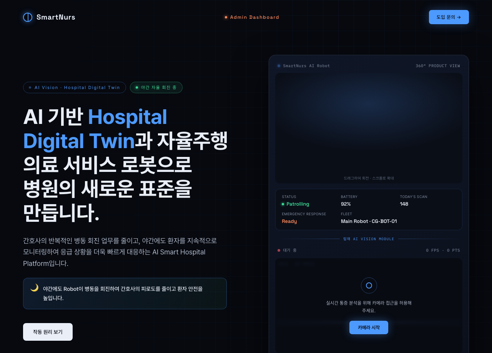
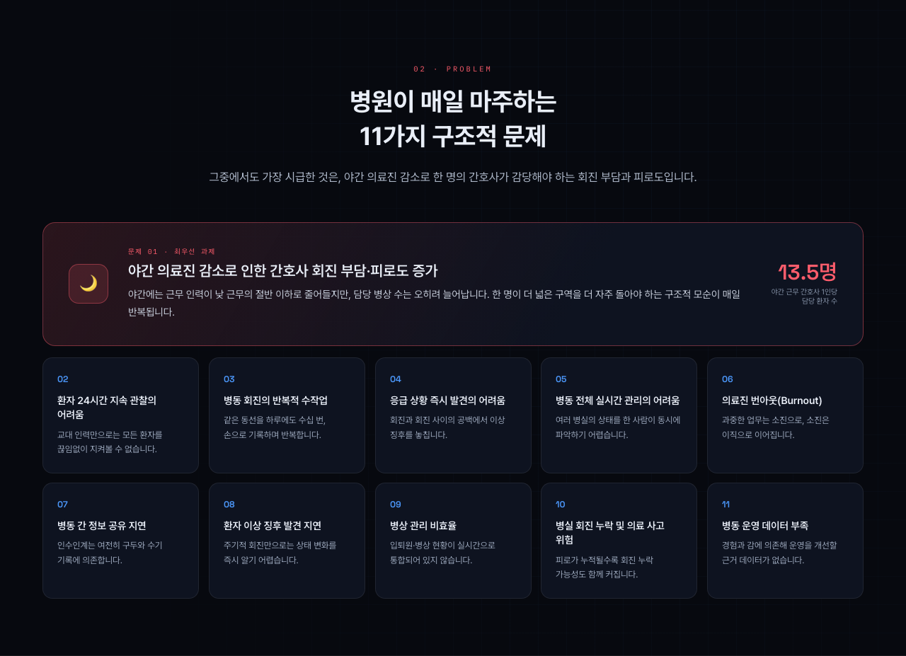
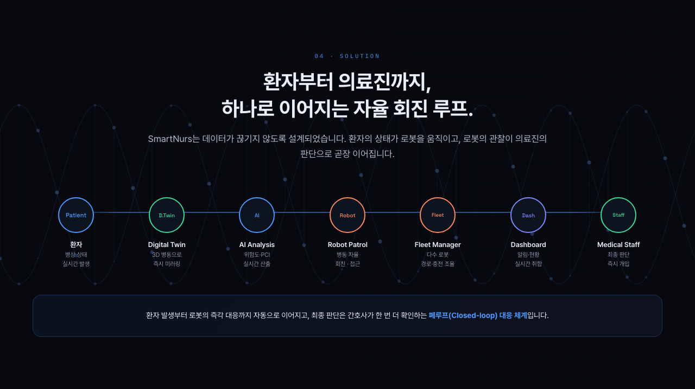
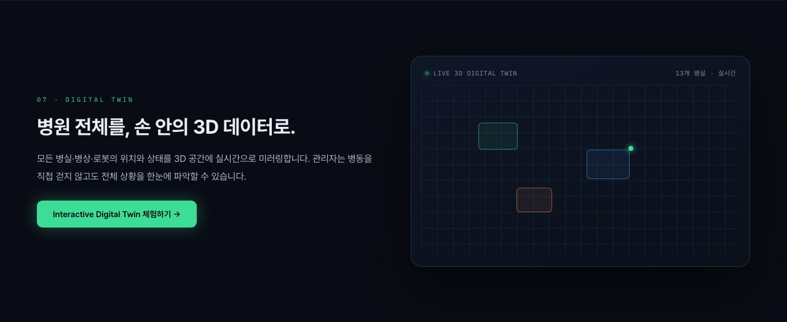
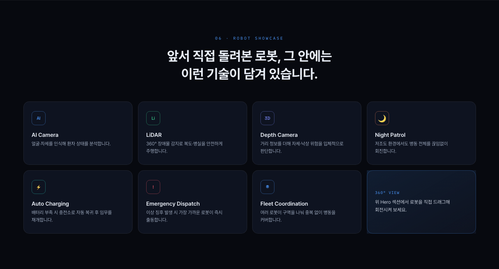
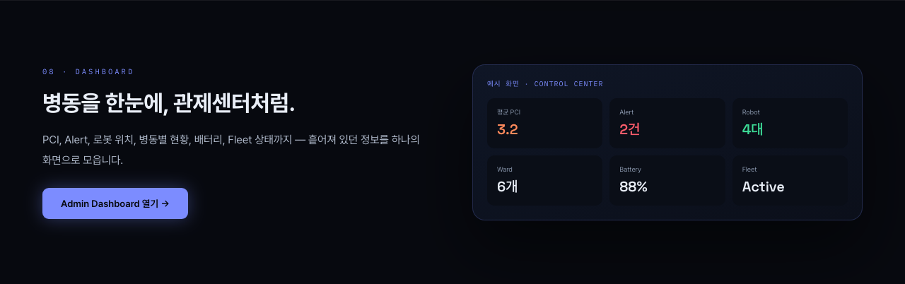
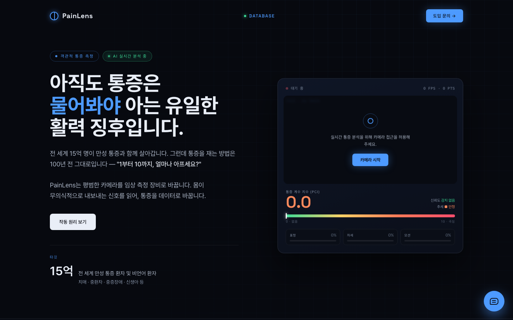

# SmartNurs · CareGuardian AI

<sub>AI 기반 스마트 병동 자율 회진 시스템</sub>

> **"회진 사이의 30분을, 사각지대로 두지 않는다."**
>
> 간호사의 이산적(discrete) 병동 회진을 **연속 모니터링**으로 바꾸고,
> 먼저 확인해야 할 환자를 AI가 추천하는 스마트 병동 플랫폼 기획안.



<p align="center">
  <a href="https://kdg-04.github.io/2026-Youngnam-Robot-AI-Regional-Nexus/"><b>발표 페이지</b></a>
  &nbsp;·&nbsp;
  <a href="https://kdg-04.github.io/2026-Youngnam-Robot-AI-Regional-Nexus/patient-lens/">PainLens 데모 (카메라 필요)</a>
  &nbsp;·&nbsp;
  <a href="docs/project-plan.md">기획서</a>
</p>

| | |
|---|---|
| **프로젝트명** | SmartNurs (CareGuardian AI) |
| **행사** | 2026 Youngnam Robot+AI Regional Nexus 혁신 캠프 |
| **일자** | 2026년 6월 29일 ~ 7월 3일 (4박 5일) |
| **장소** | 울산 머큐어 앰배서더 호텔 |
| **주최** | 영남권 5개 전문대 공동 (동의과학대 · 마산대 · 연암공과대 · 영진전문대 · 울산과학대) |
| **결과** | 🏆 **아이디어톤 장려상** |
| **팀** | Team 13 · 5인 |
| **팀원** | 박0희 (PM) — 사업 기획 · 프로젝트 총괄 |
| **팀원** | **강대경** — 플랫폼 개발 · Dashboard · 발표 페이지 구현 · 심사 발표 |
| **팀원** | 박0무 — 회로 설계 · 전원 시스템 |
| **팀원** | 김0균 — 의료 로봇 설계 |
| **팀원** | 손0호 — 기구 설계 · 프로토타입 |
| **산출물** | 기획 + 발표용 웹 페이지 (실서비스 개발 전 단계) |

> ### ⚠️ 자료에 대한 고지
>
> 이 저장소는 **아이디어톤 출품작의 기획 자료**다. 발표 페이지는 동작하는 제품이 아니다.
>
> - **관제 화면(`index.html`)의 환자 상태값은 발표용 시뮬레이션 데이터**다.
> - 다만 **`patient-lens/`는 실제로 동작한다.** MediaPipe로 카메라 영상에서 표정을 읽어 통증 지수를 산출한다.
> - 로봇은 화면 안의 시뮬레이션이다. 실물 하드웨어 연동은 이루어지지 않았다.
> - `vendor/dc-runtime.js`는 제작 도구가 생성한 런타임으로, 직접 작성한 코드가 아니다.
> - **기획(문제 정의 · PCI 설계 · 서비스 전략)은 팀 공동 작업이다.**
>   이 저장소의 웹 구현과 화면 설계, 그리고 심사 발표를 강대경이 맡았다.
> - **팀원 이름은 익명 처리했다.**

---

## 1. 문제

병동 간호는 **이산적인데 위험은 연속적**이다.



```
간호사 회진
   │
병실 방문 → 환자 상태 육안 확인
   │
이상 발견 시 기록/보고
   │
다음 병실로 이동  ← 반복
```

- **야간 근무 간호사 1인당 담당 환자 13.5명** — 인력은 낮 근무의 절반 이하로 줄지만 병상 수는 오히려 늘어난다
- 회진과 회진 **사이의 공백**에 일어난 통증 악화·낙상은 뒤늦게 발견된다
- 환자가 호출벨을 누르지 못하는 상황(의식 저하, 통증으로 인한 무력감)에 취약하다
- **어떤 환자를 먼저 봐야 하는지**가 경험과 직감에 의존한다

> 회진은 이산적(discrete)이고 위험은 연속적(continuous)이다.
> 이 간극이 문제의 본질이었다.

---

## 2. 해결 방식



### 2-1. PCI — 환자 상태를 하나의 숫자로

환자 상태를 **PCI(Patient Condition Index)** 로 표준화한다. 높을수록 위급하다.

```
PCI = 통증(Pain)       × 0.4
    + 자세위험(Posture) × 0.3
    + 낙상위험(Fall)     × 0.3
```

> ⚠️ 가중치 `0.4 / 0.3 / 0.3`은 **팀 기획 단계에서 정해진 초기값**이다.
> 산정 근거와 임상적 검증은 캠프 기간 내에 이루어지지 않았다.

### 2-2. AI Priority — "먼저 볼 환자"를 추천

1. 전체 환자를 **PCI 내림차순 정렬**
2. **급격한 PCI 상승**을 감지하면 가중치를 더한다 — 절대값이 낮아도 변화가 크면 위험하다
3. 상위 환자를 Dashboard 최상단에 올린다
4. 최상위 위험 환자에게 **Robot Dispatch를 자동 제안**한다

핵심은 **AI가 판단을 대신하지 않는다**는 것이다.
순서를 제안할 뿐, 최종 확인은 간호사가 한다.
의료 영역에서 자동화의 선을 어디에 그을지가 팀 기획 단계의 핵심 쟁점이었다.

### 2-3. Digital Twin — 병동을 화면에 1:1로



실제 병동을 격자로 미러링한 가상 관제 뷰다.
PCI에 따라 병실 색이 실시간으로 바뀌고, 로봇의 이동 경로가 그 위에 그려진다.

### 2-4. Robot Fleet — 판단과 물리적 대응을 잇는다



위험을 감지하는 것으로 끝내지 않고 **로봇이 실제로 그 병실까지 간다.**
발표 페이지에서는 이 부분을 시뮬레이션으로 구현했다 — 병동 격자 위에서 벽과 침대를 피해
경로를 찾고, 여러 대가 회진·충전·긴급 출동을 나눠 맡는 흐름을 보여준다.

| 로봇 상태 | |
|---|---|
| 충전 중 · 출동 대기 · 회진 이동 | 평상시 순환 |
| 환자 스캔 · 환자 모니터링 | 병실 도착 후 |
| 긴급 출동 · 충전 복귀 · 입구 대기 | 예외 상황 |

### 2-5. 관제 Dashboard



---

## 3. PainLens — 유일하게 실제로 동작하는 부분



> **"아직도 통증은 물어봐야 아는 유일한 활력 징후입니다."**

전체 시스템 중 **AI 분석이 실제로 구현된 유일한 화면**이다.
`patient-lens/`를 브라우저에서 열면 카메라가 켜지고, 실시간으로 통증 지수가 계산된다.

- **MediaPipe `tasks-vision`** 의 `FaceLandmarker`로 얼굴 랜드마크와 **blendshape**(표정 근육 단위)를 추출
- 눈 찡그림 · 눈썹 내림 등의 지표를 조합해 통증을 추정
- 프레임 단위 값은 흔들리므로 **지수이동평균으로 평활화**한다

```js
this.pciEMA = this.pciEMA * 0.92 + rawPain * 0.08;
```

- 표정 · 자세 · 모션 항목별 기여도와 **신뢰도**를 함께 표시한다

외부 의존성 없이 파일 하나로 동작하며, 카메라 권한만 있으면 바로 실행된다.

> ⚠️ 의료기기가 아니다. 통증 추정값은 검증되지 않았으며 임상적 판단에 사용할 수 없다.

---

## 4. 이 기획의 핵심

| 기존 병동 | SmartNurs |
|---|---|
| 회진 사이의 공백에서 이상 징후를 놓친다 | **연속 모니터링**으로 사각지대 축소 |
| 경험과 감으로 우선순위를 판단한다 | **PCI 기반 정량 지표**로 표준화 |
| 전용 장비·웨어러블 설치가 필요하다 | **카메라만으로** 즉시 측정 |
| 이상 발견 시 사람이 직접 이동한다 | **로봇 Dispatch**로 물리적 대응 |
| — | **AI는 순서만 제안하고, 확인은 사람이 한다** |

**하나의 목표:** *놓치는 환자를 만들지 않는다.*

---

## 5. 저장소 구성

```
SmartNurs/
├── README.md                 이 문서
├── index.html                발표 페이지 (14개 섹션)
├── theme.css                 반응형 레이어
├── robot-fleet.js            Digital Twin · Robot Fleet 시뮬레이션
├── vendor/
│   └── dc-runtime.js         제작 도구 생성 런타임 (직접 작성 아님)
├── patient-lens/
│   └── index.html            PainLens — MediaPipe 통증 추정 (실동작)
├── docs/
│   └── project-plan.md       기획서 원본
└── screens/                  화면 캡처
```

---

## 6. 현재 상태

**아이디어톤 출품작**으로, 아이디어 제안 · 시스템 기획 · 발표 페이지 제작까지 진행된 단계다.
실제 서비스 개발은 이루어지지 않았다.

- 관제 화면의 AI 분석은 기획이며, 실제 인식은 `patient-lens/`에만 구현되어 있다
- 로봇은 화면 안의 시뮬레이션이다. 하드웨어 설계는 팀의 기계·전자 담당 팀원들이 별도로 진행했다
- PCI 가중치는 팀 기획 단계에서 정한 초기값이며, 산정 근거는 검증되지 않았다
- 실제 병원 환경에서 검증한 적은 없다

---

## 7. 참고

- 화면에 등장하는 환자 이름 · 병실 번호 · 수치는 모두 발표용 예시 데이터다
- 팀원 이름은 익명 처리했다
- 이 저장소는 개인 포트폴리오 목적으로 공개한다
